# IoT Simulator for IBM Cloud IoT Platform

## Prereq

### Node.js

On your workstation you need to install Node.js (and npm which is typically part of the node.js installation). The packages can be found [here](https://nodejs.org/en/download/). Install the LTS version. 

To test if node and npm are installed execute:

```
$ node -v
$ npm -v
```

Result is the version of both executables.

### IBM Cloud IoT Platform Starter

In the IBM Cloud Dashboard create an instance of the [IoT Platform Starter](https://cloud.ibm.com/docs/IoT-starter?topic=iot-starter-gettingstartedtemplate).

Perform the following steps to deploy the IoT Starter:

1.   Create an instance of the Starter Kit:

        a. Log in to or register for IBM Cloud at https://cloud.ibm.com.

        b. Open the catalog by selecting the catalog tab.

        c. Select the Starter Kits  category and there select the Internet of Things Platform Starter.

        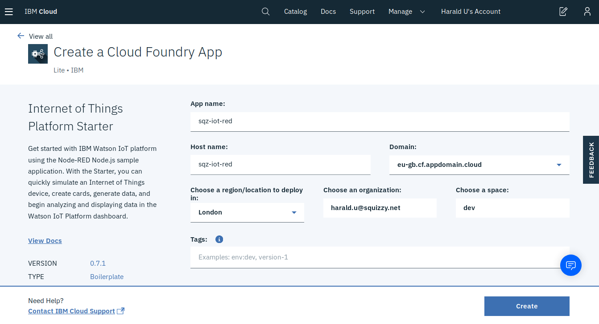

        d. On the Create a Cloud Foundry App page, enter a unique

            App Name
            Host Name

        and verify the selections  for:   

            Region/Location
            Organization
            Space

        Leave the defaults for the rest.    

2. Click Create to add Node-RED to your IBM Cloud organization.        
After the application is deployed, the Getting Started with Watson IoT Platform Starter page is displayed. 
        
Note: The staging process might take a few minutes.

## Register an IoT Device

Complete the following steps to prepare  a scenario that uses a simulated thermostat to monitor temperature and humidity of a room.

1.   Launch the IoT Platform dashboard.

        a. In the Resource list in the Cloud Foundry Services section click the name of your IoT Platform instance. The instance name usually ends with -iotf-service.

        b. Click Launch button to open the IoT Platform dashboard in a new browser tab.

 2. Make TLS optional
      
      TLS is enforced for connection security by default (good thing for a production environment) but for the sake of simplicity we are going to make TLS optional for this workshop.

      a. In the menu on the left side click Security, then on the Edit icon for Connection Security.

      b. For scope Default, select Security Level 'TLS Optional'. Click OK on the Warning pop-up. Then click Save in the upper right corner.

      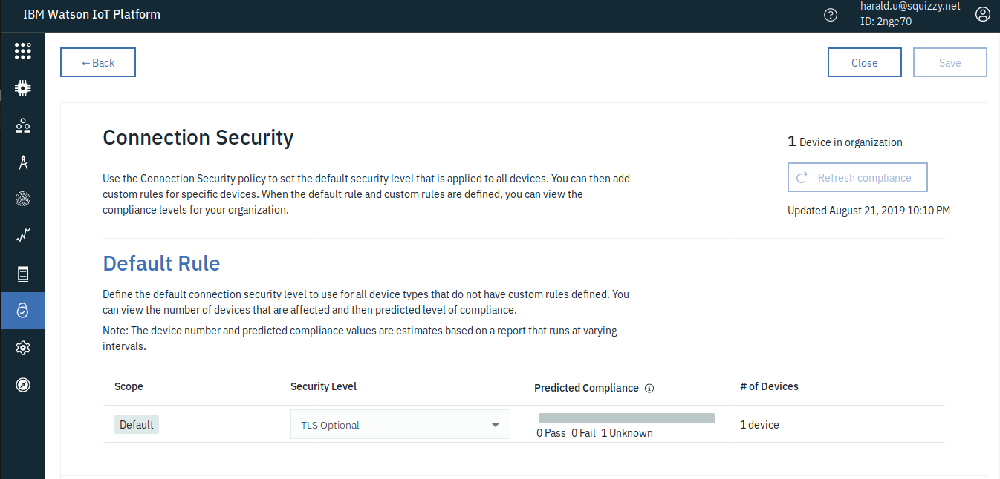

3.   Create a device type.

        a. From the main menu, select Devices.

        b. Open the Device Types tab (from: Browse | Action | Device Types | Interfaces)

        c. Click  Add Device Type, 
        Enter a unique name (e.g. "simulator") and description for your device type, and click Next.

        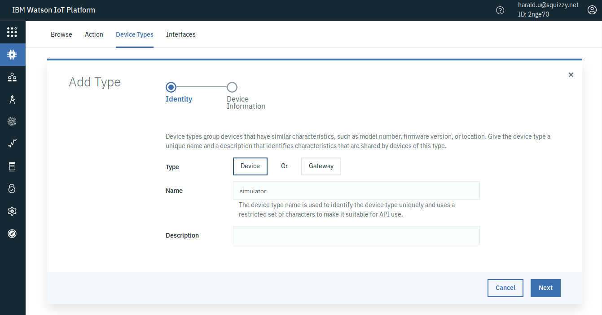

        (optional) Defining a Template and Metadata on the next two pages is optional and can be safely skipped by clicking Next on each page.

        d.  Click Finish to add the device type.

4.   Add a device that uses the newly created device type

       a. Click Register Devices. The device type that you just created is displayed in the list of device types.

       b. Enter a unique Device ID (e.g. "sim-1"). Click Next.

        (optional) Providing descriptive data on the Add Device page or entering device metadata on the next page is optional, and you can safely skip those pages by clicking Next on each page.

        c.  On the Security page, enter an Authentication Token = password for your new device, then click Next.

        d. On the Summary page, verify that the information is correct and click Finish to add the device. 
         
 Make a note of the information that is displayed in the Your Device Credentials page. 
You need the following information to configure the simulator and display the data:

        * Organization ID
        * Device Type
        * Device ID
        * Authentication Token (= Password)

Keep this page open in your browser, but go to Recent Events or State. They will be empty for now.

## Run the IoT Simulator 

On your workstation:

```
$ cp template.config.json config.json
```

Edit config.json and add the info from the Device Credentials of the IoT Platform (leave the quotes "" around the values!)

* Org 
* Device Type
* Device ID
* Device Password
* Event name (change if you don't like "dhbw")

It should look similar to this:

```
{
    "ORG":"abcdef",
    "DEVICE_TYPE":"simulator",
    "DEVICE_ID":"sim-t480",
    "PASSWORD":"Passw0rd",
    "EVENT":"dhbw"
}
```

Install the node.js dependencies with:

```
$ npm install
```

Start the Simulator with:

```
$ npm start
```

You should see something like

```
> node-iot@1.0.0 start /home/harald/git/iot-nodejs
> node app.js

URL: mqtt://abcdefg.messaging.internetofthings.ibmcloud.com
Topic: iot-2/evt/dhbw/fmt/json
Client connected  true
Publishing {"d":{"temp":15,"humidity":50}}
Publishing {"d":{"temp":17,"humidity":55}}
Publishing {"d":{"temp":18.5,"humidity":61}}
Publishing {"d":{"temp":20,"humidity":68}}
Publishing {"d":{"temp":21.5,"humidity":65}}
```

Go back to your browser which should still display your device in the IoT Platform Dashboard. On the Recent Events or State section you should see your messages coming in every 5 seconds.

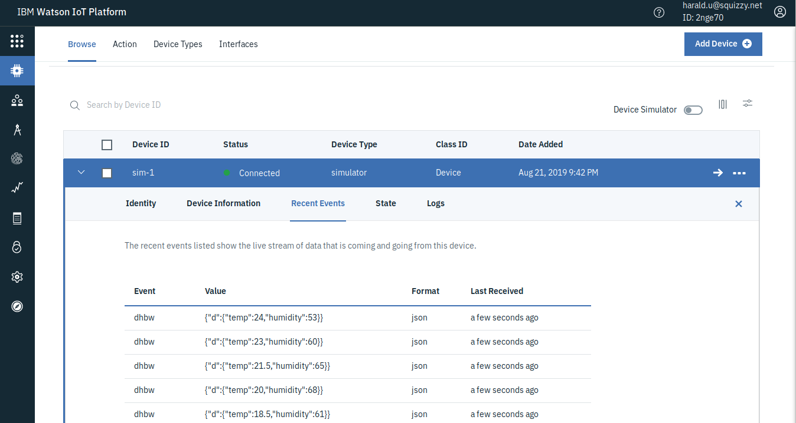

## Node-RED

When you installed the IoT Platform Starter in the beginning of this lab, you installed the IoT Platform Service that we used already and a Cloud Foundry app that runs Node-RED at which we will look now. 

[Node-RED](https://nodered.org/) is "_a programming tool for wiring together hardware devices, APIs and online services in new and interesting ways._" It is a browser-based programmin tool where you wire "nodes" together to form a flow and Node-RED creates node.js code from it and executes it. It has started as a simple graphical programming tool for the Internet of Things by IBMers Nick O'Leary and Dave Conway-Johnes and is now an open source project at the JS Foundation.

You can find your Node-RED application in the IBM Cloud Dashboard in the Resource List under Cloud Foundry Apps. You may need to click on the ">" in Front to see the apps.

Your Node-RED app should end on -iot-red. Click on the name of your app , this will open the Overview page of the app. Under Connections you can see 2 Services, a Cloudant Database and the IoT Platform Service, are bound to the Cloud Foundry App. Cloudant is a NoSQL database and used to store the code, Cloud Foundry apps have no persistent file system.

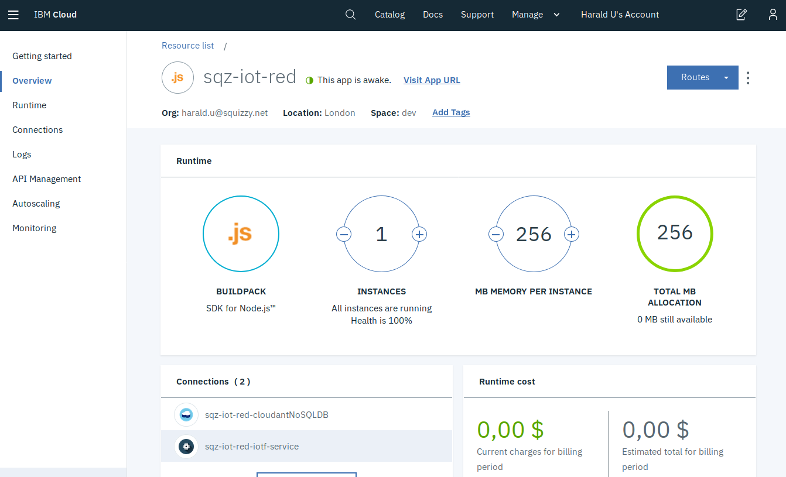

Click on Runtime and Environment Variables. Here you see something Cloud Foundry specific. Cloud Foundry uses an environment variable (VCAP_SERVICES) that is injected into the container that executes the application code. The application is able to read the environment variable which contains the credentials (all the information that an application needs to access a service like URL, user, password, and such) of all bound services. If you scroll through VCAP_SERVICES you can see 2 JSON objects, one for "iotf-service" and another for "cloudantNoSQLDB" and they contain the access information for IoT Platform and Cloudant. 

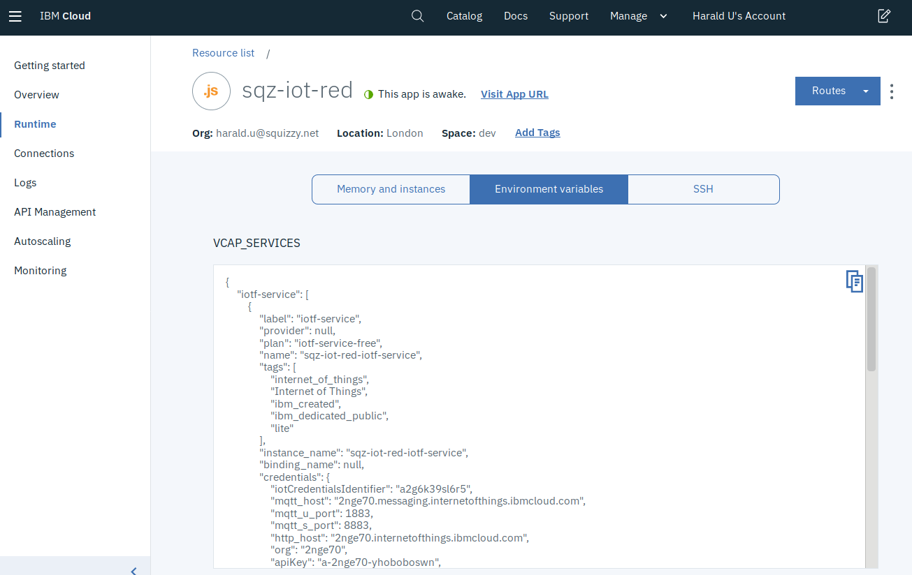

Now click on "Visit App URL" .

When you start Node-RED on the IBM Cloud for the first time you are asked to secure the editor. This is a good thing otherwise it would be accessible to everybody on the Internet. Secure it by entering a Username and Password (which you should be able to remember!) A certain level of password complexity is required otherwise you can't continue. Finish the setup and wait for a generic Node-RED page to appear. Click on "Go to your Node-RED flow editor". It will ask for your Username and Password. 

Node-RED will open with a example "flow":

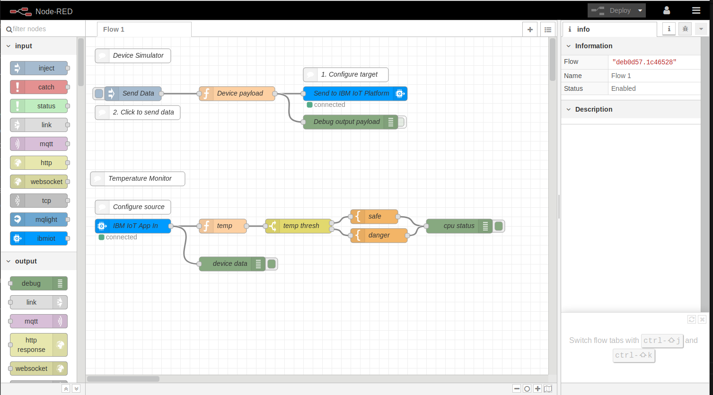

The left part is the "Palette", the middle section is the workspace, on the right you can see different types of information, default is to open up in the "Information" view.

We will not use this example, instead create our own. But we need to turn of the debug nodes, these are the green nodes with the names "cpu status" and "device data". When the debug nodes are "ON" they look like this:

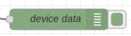

To turn the "OFF" click on the slider on the right side, it now looks like this:

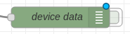

The slider is greyish, and there is a blue bubble at the node. The blue bubble indicates that there has been a change on the node and it hasn't been deployed yet. The "Deploy" button in the upper right corner turn from grey to red. Click on it!

You see a "Successfully deployed" message slide in and out, the Deploy button is grey again, and the blue bubble disappeared. 

You are now ready to create your first "flow".  

1. To add a new empty workspace click on the "+" button at the top ("Add Flow"). A second tab opens (Flow 2).

2. From the "input" section of the palette drag and drop a blie "ibmiot" node to the workspace.

3. From the "output" section of the palette drag and drop a green "debug" node to the workspace and place it to the right of the "ibmiot" node".

4. Both nodes have a grey I/O "port" (grey squares with rounded corners), the "ibmiot" node on the right side (this is an output), the "debug" node on the left side (this is an input). If you move the cross shaped cursor directly over an I/O port, its color changes to orange. At that moment you click the left mouse button, then you can draw a wire connection to another I/O port while holding the mouse botton. When you reach the other I/O port, release the mouse button. Using this method connect the "ibmiot" node with the "debug" node:

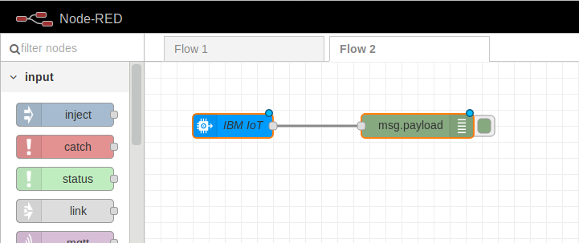

5. Double click the "ibmiot" node, this opens the Properties dialog. 

6. Authentication is "Bluemix Service". IBM Cloud was called IBM Bluemix initially. "Bluemix Service means that Node-RED is getting the IoT Platform credentials from the VCAP_SERVICES environment variable.
Input type should remain "Device Event", we use an event topic in the simulator code.
Enter the name of your "Device Type", select "All" for ID and Event, "json" for Format. Click "Done" then "Deploy". 

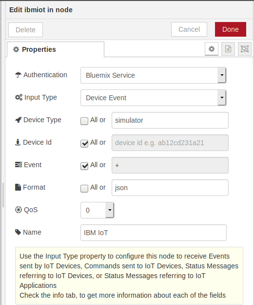

7. If your node.js simulator is stopped, start it again (npm start).

8. In the right window section, open the Debug view ("bug" icon). You should see the MQTT messages coming in:

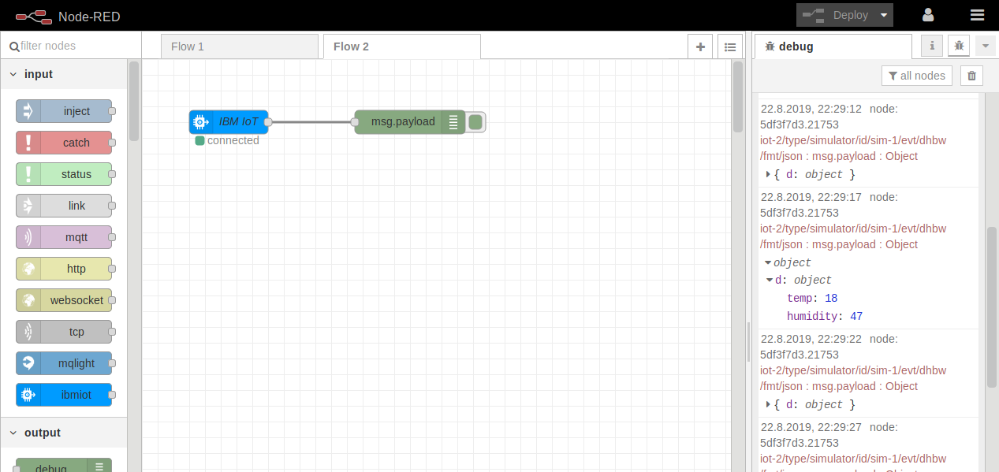

 We now have a full MQTT chain: a (simulated)device is sending sensor data (temperature and humidity) via MQTT to an MQTT Broker (IoT Platform), an application is subscribing to this data and simply displaying it. 

 In the next section we will learn how to display data a little nicer by extending Node-RED. s
