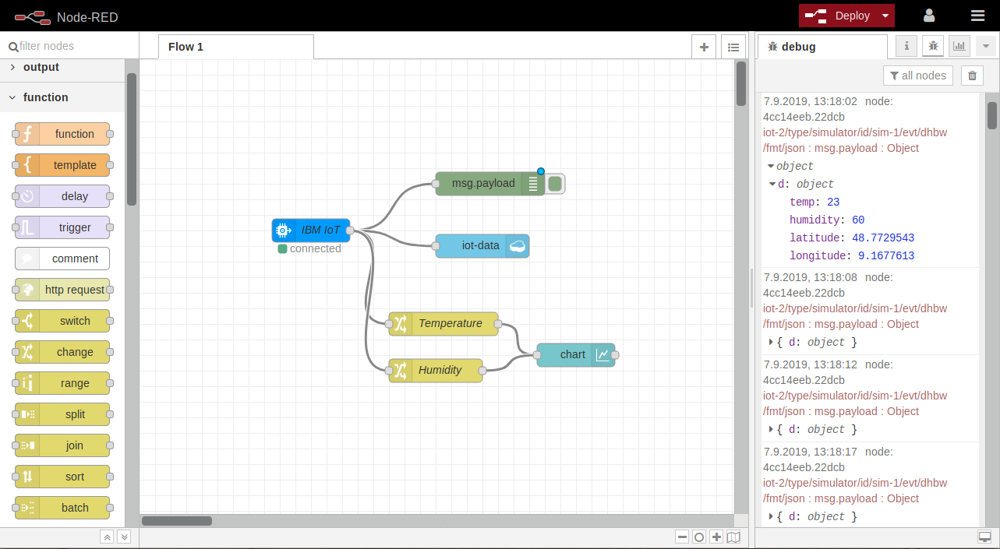

# Internet of Things with the IBM Cloud IoT Platform

In this workshop you learn to use the IBM IoT Platform, a cloud-based MQTT Broker, and Node-RED, a graphical flow-based programming tool  very well suited for IoT projects. You are going to simulate a Thing = IoT device on your workstation with the use of a little Node.js app.



## Prerequisites

### IBM Cloud Account

You need to register for an IBM Cloud Account. A so called Lite account which is free of charge will do. Register at [https://cloud.ibm.com](https://cloud.ibm.com).

After registration check your emails. To complete the registration you will need to click a link in a verification email that will be sent to the email account you used for registration. If you don't receive this email check your spam folder.

### Node.js

On your workstation you need to install Node.js (and npm which is typically part of the node.js installation). The packages can be found [here](https://nodejs.org/en/download/). Install the LTS version. 

To test if node and npm are installed execute:

```
$ node -v
$ npm -v
```

Result is the version of both executables.

__Follow these topics in order please:__

1. [IBM Cloud IoT Platform Starter](documents/1-IoT-Starter.md)
2. [IBM Cloud IoT Platform Service](documents/2-IOTP.md)
3. [IoT Simulator](documents/3-APP.md)
4. [Node-RED on IBM Cloud](documents/4-NODERED.md)
5. [Display data in the Node-RED Dashboard](documents/5-DASHBOARD.md)


