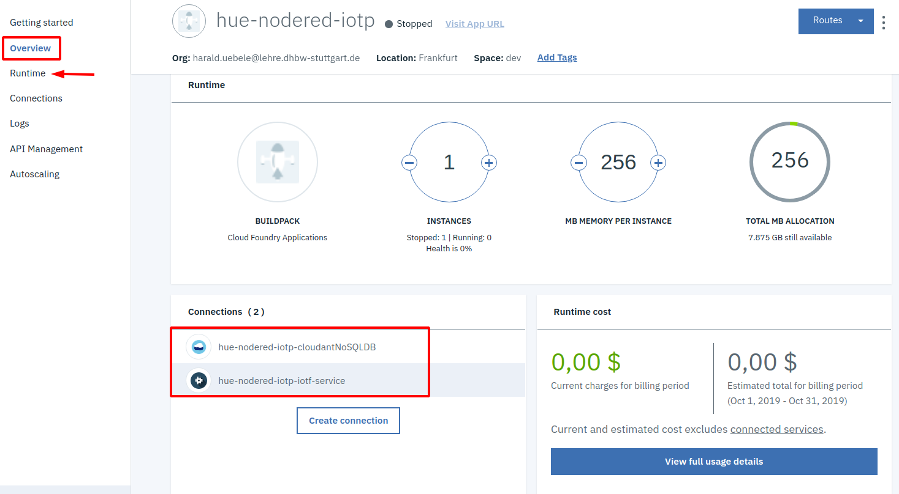
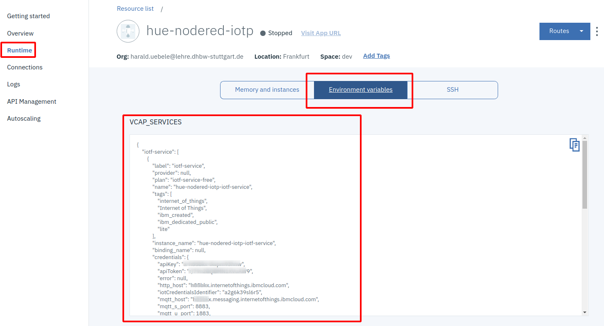

### IBM Cloud IoT Platform Starter

In the IBM Cloud Dashboard create an instance of the [Internet of Things Platform Starter](https://cloud.ibm.com/docs/IoT-starter?topic=iot-starter-gettingstartedtemplate#gettingstartedtemplate).

The starter includes:

* Node-RED running as a Cloud Foundry application
* Cloudant DB (NoSQL) as persistence storage for Node-RED
* Internet of Things Platform, our MQTT Borker

Perform the following steps:

a. Log in to or register for IBM Cloud at https://cloud.ibm.com.

b. Open the catalog by selecting the catalog tab.

c. Select the Starter Kits category and there select the Internet of Things Platform Starter.

d. On the Create a Cloud Foundry App page, select a region, then scroll down

e. In the "Configure your resource" area, if you see "No org available" for the organization and/or "No space avalable" for space, go back and select another region, then try again.

f. Enter a unique (e.g. add your intials to name):

* App Name
* Host Name (the same as App name)
* Domain (leave default)

and verify the selections  for:   
* Organization
* Space

Leave the defaults for the rest.    

g. Click Create.

After the application is deployed, the Getting Started page of your new app is displayed. The status will be "starting" for a while, this will switch to "ready" or "This app is awake" once it is started. If it doesn't start there is a fix for it in the next section.
        
Note: The staging process might take a few minutes.

## Node-RED

You just created a Cloud Foundry app that runs Node-RED on Node.js. 

[Node-RED](https://nodered.org/) is "_a programming tool for wiring together hardware devices, APIs and online services in new and interesting ways._" It is a browser-based programming tool where you wire "nodes" together to form a flow and Node-RED creates node.js code from it and executes it. It has started as a simple graphical programming tool for the Internet of Things by IBMers Nick O'Leary and Dave Conway-Johnes and is now an open source project at the JS Foundation.

We may need to fix something before the app is able to start. Open the "Logs" page of your app:

Scroll down in the log and check if you see a "Failed to compile droplet" error. The message above it will then most likely show that there is no version 6.x in the Node.js buildpack. 

What happens: The Node.js buildpack supports multiple Node.js versions. The developer of a Node.js application can specify a specific Node.js version in the package.json file. In our case the Node-RED application of the Starter App requests Node.js version 6. But version 6 support has recently been removed from the Node.js buildpack, minimum is now version 8, that is the reason why the Starter App cannot start.

Maybe this issue is fixed by the time you run this exercise and your app will start as expected without issues. But if you see this error, the app __will not be able to start__ and we will need to fix it ourselves.

---
### The app doesn't start! Changing the Node.js version of the starter app

Go to the Overview page of the app and scroll down a bit:

Click on the "Enable" button for Continuous Delivery. This will create a "Continuous Delivery Toolchain".

In the resulting screen, select "Delivery Pipeline (required)" and click on "Create" for an API Key. In the Popup, click "Create" again. 

Now click "Create" in the upper right corner of the "Continuous Delivery Toolchain" dialog.

The result looks like this:

The system created a Git Repository for issues and code, a "delivery pipeline", and an Eclipse Orion Web IDE.

Click on IDE, select the file "package.json":

Modify:

* change "bcrypt" to version "3.0.6"
* add "node-red-dashboard" with version "2.x", don't forget the , at the end of the line above!
* change "node" to version "10.x"

Save the file (via File menu or with Ctl-s). Then open the Git client of the IDE (2nd icon in the left menu):

Enter a commit message, click the "Commit" button, the commit will show up in the Outgoing area, then click "Push" there. There should be a message that the Push was successful.

Click on the left arrow (<--)  in the upper left corner (next to "Repository") to return to the toolchain overview, there click on "Delivery Pipeline":

Wait until the Build Stage is green and shows "STAGE PASSED" and the Deploy Stage turned blue and shows "STAGE RUNNING ...", then click on "View logs and history". There you can watch the Cloud Foundry build process which should end with a green "Finished: SUCCESS" message.

If it doesn't finish successful, check the log for errors.

---

### Continue with the IoT Platform Starter

Open the Overview page of your app. Under Connections you can see two services, a Cloudant Database and an IoT Platform Service, bound to the Cloud Foundry App. Cloudant is a NoSQL database and used to store the code, Cloud Foundry apps have no persistent file system.

Click on Runtime and Environment Variables. Here you see something Cloud Foundry specific. Cloud Foundry uses an environment variable (VCAP_SERVICES) that is injected into the container that executes the application code. The application is able to read the environment variable which contains the credentials (all the information that an application needs to access a service like URL, user, password, and such) of all bound services. If you scroll through VCAP_SERVICES you can see a JSON object for "iotf-service" and another JSON object for "cloudantNoSQLDB", they contain the access information for the services. 

Now click on "Visit App URL" .

When you start Node-RED on the IBM Cloud for the first time you are asked to secure the editor. This is a good thing otherwise it would be accessible to everybody on the Internet. Secure it by entering a Username and Password (which you should be able to remember!) A certain level of password complexity is required otherwise you can't continue. Finish the setup and wait for a generic Node-RED page to appear. Click on "Go to your Node-RED flow editor". It will ask for your Username and Password. 

Node-RED will open with an sample "flow":

The left part is the "Palette", the middle section is the workspace, on the right you can see different types of information, default is to open up in the "Information" view.

We will leave the example on "Flow 1" but need to deactivate the two active Debug nodes: click on the slider on the right side of the node, the slider will "move in" a bit, its color will turn from green to grey, a blue dot will appear at the nodes. Click the red "Deploy" button, when deployment is complete, the button will turn grey. Click on "+" to create another empty flow ("Flow 2").

We will return to Node-RED later in this exercise.

__Continue with [IBM Cloud IoT Platform Service ](2-IOTP.md)__   
