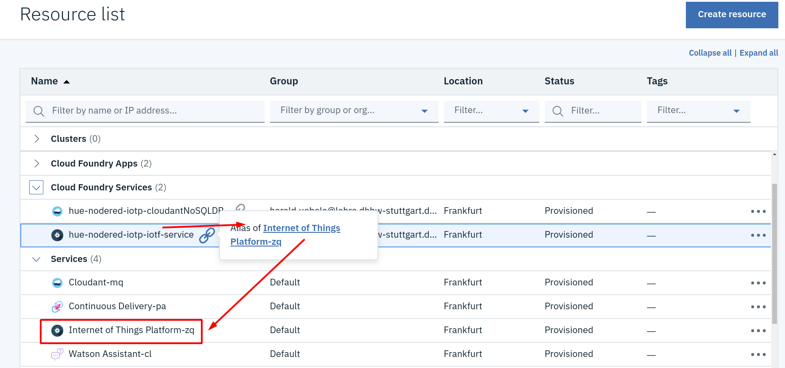
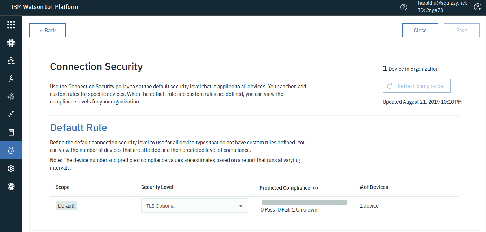
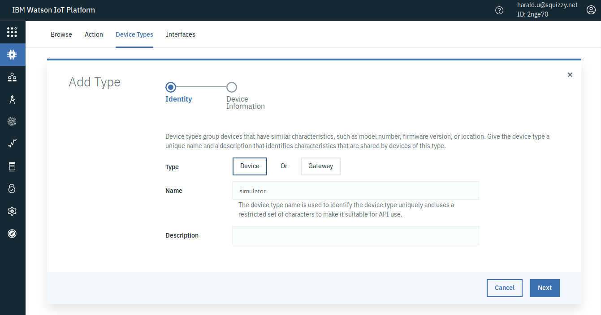
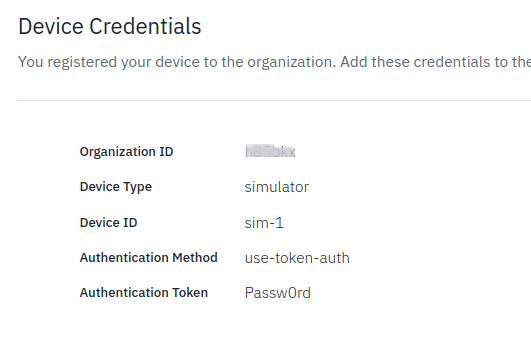

# IBM Cloud IoT Platform Service

The  IBM Cloud IoT Platform (IoTP) Service is a MQTT Broker "as a Service" on the IBM Cloud. An instance of it has been created as part of the IoT Platform Starter in the previous part of this exercise.

You will find the IoTP Service in the Resource list of the IBM Cloud, in the Services section. There is an IoTP Service in the Cloud Foundry Services section, too, but that is a link only:

## Register an IoT Device

In the Resource list, click on the name of the service (e.g. Internet of Things Platform-zq), then click on the blue "LAUNCH" button to open the IoTP Dashboard.

In the IoTP Dashboard complete the following steps to prepare  a scenario that uses a simulated thermostat to monitor temperature and humidity of a room.

1. Make TLS optional
      
    TLS is enforced for connection security by default (good thing for a production environment) but for the sake of simplicity we are going to make TLS optional for this workshop.

    a. In the menu on the left side click Security, then on the Edit icon for Connection Security.

    b. For scope Default, select Security Level 'TLS Optional'. Click OK on the Warning pop-up. Then click Save in the upper right corner.

    

2.   Create a device type.

        a. From the main menu, select Devices.

        b. Open the Device Types tab (from: Browse | Action | Device Types | Interfaces)

        c. Click  Add Device Type, 
        Enter a unique name (e.g. "simulator") and description for your device type, and click Next.

        

        (optional) Defining a Template and Metadata on the next two pages is optional and can be safely skipped by clicking Next on each page.

        d.  Click Finish to add the device type.

3.   Add a device that uses the newly created device type

       a. Click Register Devices. The device type that you just created is displayed in the list of device types.

       b. Enter a unique Device ID (e.g. "sim-1"). Click Next.

        (optional) Providing descriptive data on the Add Device page or entering device metadata on the next page is optional, and you can safely skip those pages by clicking Next on each page.

        c.  On the Security page, enter an Authentication Token = password for your new device, then click Next.

        d. On the Summary page, verify that the information is correct and click Finish to add the device. 
         
Copy or write down the information that is displayed in the Your Device Credentials page. 
You will need the information to configure the simulator in the next step:

Keep this page open in your browser, but go to Recent Events or State. They will be empty for now.

__Continue with [IoT Simulator ](3-APP.md)__   
