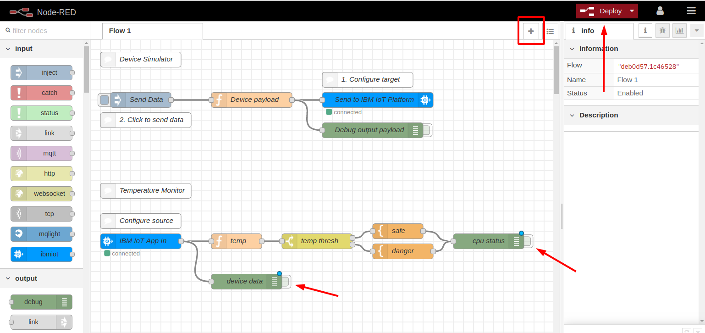
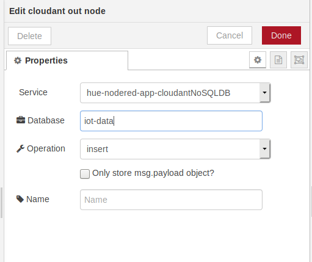
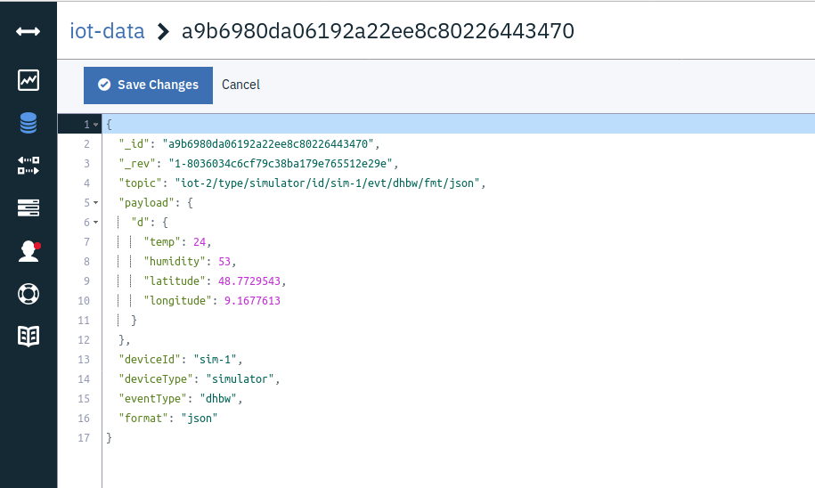

# Node-RED on IBM Cloud

In the first part of this exercise you created a Cloud Foundry app that runs Node-RED on Node.js. 

If Node-RED isn't still open in your browser from part 1,  open the app from the Resource list of IBM Cloud, then click on "Visit App URL" .

At the end of part 1 of this exercise, you have deactivated the two active Debug nodes in the example in Flow 1 (click on the slider on the right side of the node, the slider will "move in" a bit, its color will turn from green to grey, a blue dot will appear at the nodes.)   Then you created another empty flow ("Flow 2") by clicking on the "+". If the "Deploy" button should be red (indicating that there is something to deploy), click it now.

## Create a flow

You are now ready to create your first "flow".  

1. From the "input" section of the palette drag and drop a blue "ibmiot" node to the workspace.

2. From the "output" section of the palette drag and drop a green "debug" node to the workspace and place it to the right of the "ibmiot" node".

3. Both nodes have a grey I/O "port" (grey squares with rounded corners), the "ibmiot" node on the right side (this is an output), the "debug" node on the left side (this is an input). 

   If you move the cross shaped cursor directly over an I/O port, its color changes to orange. At that moment you click the left mouse button, then you can draw a wire connection to another I/O port while holding the mouse botton. When you reach the other I/O port, release the mouse button. 
   
   Using this method connect the "ibmiot" node with the "debug" node:

    

4. Double click the "ibmiot" node, this opens the Properties dialog. 

5. Select "Bluemix Service" for Authentication. Bluemix was the former name of the IBM Cloud, and Bluemix Service means we are using a IoTP Service bound the the Cloud FOundry app.
   
   Input type should remain "Device Event", we use an event topic in the simulator code.

    Enter the name of your "Device Type"(e.g. "simulator"), select "All" for ID, enter the Event (e.g. "dhbw"), "json" for Format (again, this can be found in the config.json file in iot-app). Click "Done" then "Deploy". 

    

7. If your node.js simulator on your workstation (previous section) is stopped, start it again (npm start).

8. In the right window section, open the Debug view ("bug" icon). You should see the MQTT messages coming in:

   

 We now have a full MQTT chain: a (simulated)  device is sending sensor data (temperature and humidity) via MQTT to an MQTT Broker (IoT Platform), and an application is subscribing to this data and displaying it. 

 In the next section we will learn how to save the data into the Cloudant database and then how to display data a little nicer by extending Node-RED.

### Store IoT data in Cloudant database

Cloudant is a NoSQL database. It is a commercial database service offering in the IBM Cloud and it is based on Apache CouchDB. Unlike Relational or SQL databases, NoSQL databases do not have a fixed structure of their records. Instead, they can store data in variable JSON format. Remember, our IoT data are in JSON format, too.

Have a look at the Cloudant dashboard:

1. In the Resource List, open the Cloud Foundry Services and the Services section. 

   You will see a Cloudant service in each of them, but the service in the Cloud Foundry Service section has a link symbol. When you hover your mouse pointer over the link symbol you'll see that it is an alias. IBM Cloud needs the alias to bind it to the Cloud Foundry app.

   

2. Click on the name of the Cloudant service (e.g. Cloudant-mq) in the Services section (non alias). 

   This opens the Manage Cloudant view with additional details. In the Manage section click on "Launch Cloudant Dashboard".

3. The Databases view of the Cloudant dashboard opens and you should see a database "nodered". This database holds Node-RED information. Have a look at it but do not change anything, it would most likely destroy your Node-RED instance.

4. Go back to the Node-RED editor in your browser.

5. In the palette, scroll down to the "storage" section.

6. There are 2 Cloudant nodes. 

   One is a node for searching documents (input and output port), the other is a simple Cloudant output node (which only has an input). 
   
   Drag this out node to your workspace somewhere under the debug node, connect it with the ibmiot node, and double click it to open the Properties dialog.

   

7. The Service field already shows the name of the Cloudant alias.

   Enter a name for the database, e.g. "iot-data". Click Done, then Deploy.

   Make sure your simulator is still running!

8. Go back to the database view of the Cloudant dasboard. 

   You will see a database "iot-data" that hasn't been there before. It should indicate that it already contains some records. Open it.

   It looks kind of cryptic, Cloudant is automatically creating Id's for us. If you open one of the records, the data should look familiar, though. Every bit of information the IoT Platform, the MQTT Broker, provides is there. The "_id" and "_rev" fields are Cloudant internal.

   

This was a very simple way to store IoT data. You would use this if you need to archive historical data or use an anlytics or machine learning tool to further analyse the data.

__Continue with [Node-RED Dashboard ](5-DASHBOARD.md)__   
