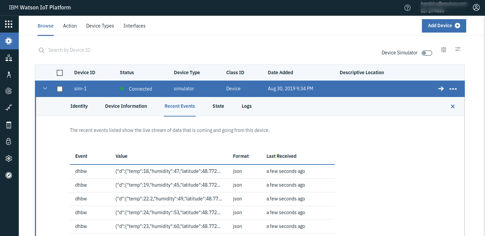

#  IoT Simulator 

We use some simple Node.js code in this repository to connect to the IoT Platform and send pseudo (simulated) data via MQTT.

1. Either clone the repository using git:
   ```
   $ git clone https://github.com/Harald-U/iot-nodejs.git
   ```
   Or download the ZIP file from:
   https://github.com/Harald-U/iot-nodejs/archive/master.zip and unzip it somewhere.

 2. Change into the apps directory:
    ```
    $ cd iot-nodejs/iot-app
    ```
    
3. Create the config .json configuration file:
    ```
    $ cp template.config.json config.json
   ```
   Edit config.json and add the info from the Device Credentials of the IoT Platform (leave the quotes "" around the values!)
   * Org 
   * Device Type
   * Device ID
   * Device Password
   * Event name (change if you don't like "dhbw")

   It should look similar to this:

   ```
   {
       "ORG":"abcdef",
       "DEVICE_TYPE":"simulator",
       "DEVICE_ID":"sim-1",
       "PASSWORD":"Passw0rd",
      "EVENT":"dhbw"
    }
   ```

4. Install the node.js dependencies with:

    ```
    $ npm install
    ```

    Start the Simulator with:

    ```
    $ npm start
    ```

    You should see messages similar to these:

    ```
    > node-iot@1.0.0 start /home/harald/git/iot-nodejs/iot-app
    > node app.js

    URL: mqtt://279***.messaging.internetofthings.ibmcloud.com
    Options:  { clientId: 'd:279***:simulator:sim-1',
    username: 'use-token-auth',
    password: 'Passw0rd' }
    Topic: iot-2/evt/dhbw/fmt/json
    Client connected  true
    Publishing {"d":{"temp":15,"humidity":50,"latitude":48.7729543,"longitude":9.1677613}}
    Publishing {"d":{"temp":17,"humidity":55,"latitude":48.7729543,"longitude":9.1677613}}
    Publishing {"d":{"temp":18.5,"humidity":61,"latitude":48.7729543,"longitude":9.1677613}}
    Publishing {"d":{"temp":20,"humidity":68,"latitude":48.7729543,"longitude":9.1677613}}
    ```

5. Go back to your browser which should still display your device in the IoT Platform Dashboard. On the Recent Events or State section you should see your messages coming in every 5 seconds.

    
    

__Continue with []()__   