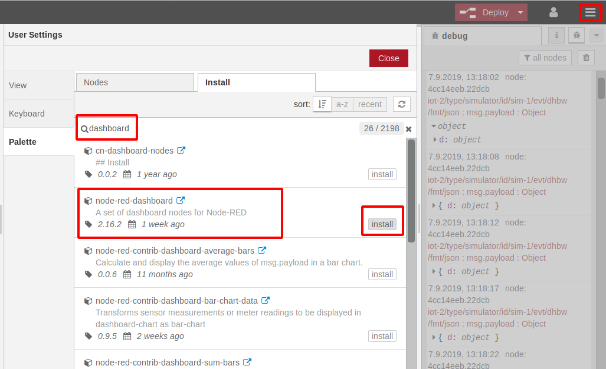
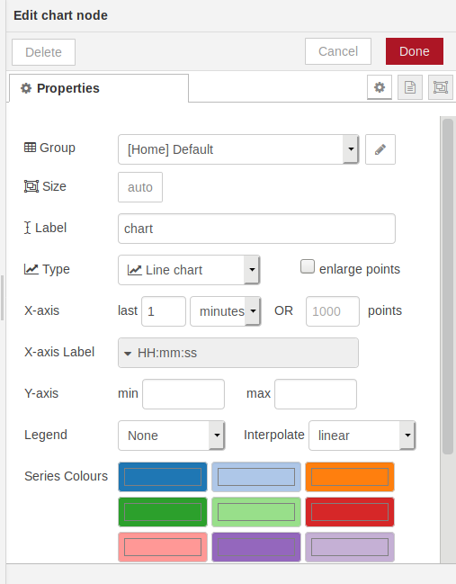
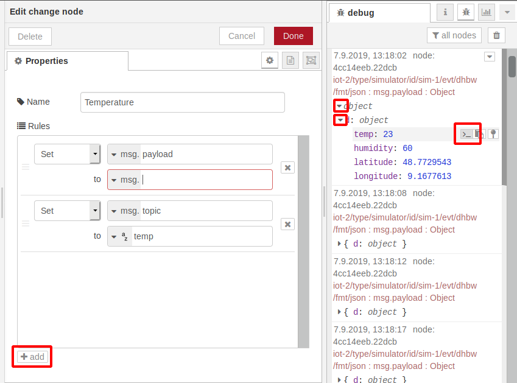
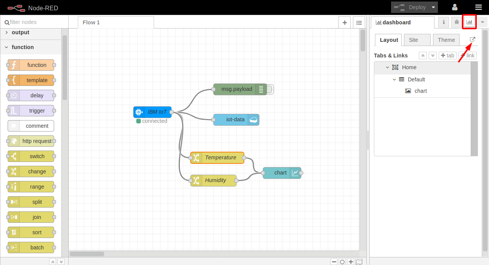
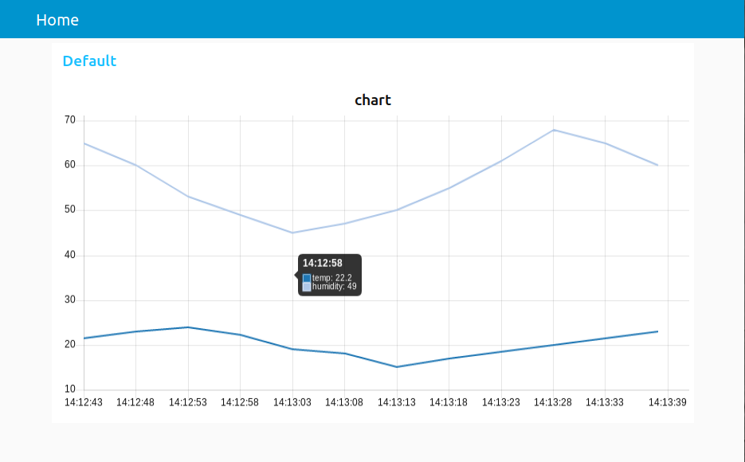

### Display IoT data in a Node-RED dashboard

Node-RED can be extended very easily. There is a large community of contributors that provide extensions, you can find them [here](https://flows.nodered.org/?num_pages=1). 

Try and search for the term "dashboard" in the Node-RED Library and only search for nodes. At the tme of this writing I found 25 entries! There is one called "node-red-dashboard". If you look at its contributors you'll see Dave Conway-Johnes and Nick O'Leary among them. They are the ones who started Node-RED.

Installation of this dashboard is actually quite simple:

1. Go to the Node-RED editor view.

2. Open the Hamburger menu in the top right corner.

3. Select "Manage Palette", the "Install", search for "dashboard".

4. Click the "Install" button for "node-red-dashboard". 

In the dialog, click "Install" again.

5. Afer a moment you should see a message that a set of nodes has been installed. (This message will dissappear after a moment.) 

   "Close" the User Settings dialog. 

6. At the bottom of the Palette (left side where all the nodes are listed) are two buttons with double arrows up and down. 

   Click on the double arrows up, this will collapse the Palette so that only the section headers are visible. You should see a header "dashboard". Open it and have a look at the nodes.

7. Drag and drop a "chart" node to your workspace and double click on it to open its properties dialog.

8. "Group" is empty ("Add new ui_group"), so click on the Edit Icon.

9. In the next dialog "dashboard group config node" change the "Width" from 6 to 15 by sliding the grey bar to the right. 

   Then again click the edit icon for "Tab".  Just leave the defaults in the "dashboard tab config node" and click "Add".

10. Click "Add" again.

    _If you ask yourself what you just did, here is the explanation: You created a tab called "Home" on the Dashboard (which we haven't seen yet!) and on that tab "Home" you added a group "Default" and made it 15 units wide. This group "Default" on tab "Home" is now displayed in the Group property of the Chart node which means this is where the chart will be placed on the Dashboard._

11. Change the property "X-axis" from "last 1 hours" to "last 1 minutes", leave the rest and click "Done".

    

12. Now open the "function" section in the Pallette and drag and drop a "change" node to the workspace and place it between the ibmiot and the chart node. 

    Make sure the debug window is open on the right side and that you see some messages from the simulator. But turn off the debug node (click on the green square thing on the right side, it will slide in and turn grey which means debig is off).

13. Double click on the "change" node. 

      We are now assigning and reassigning variables. 
      
      Our simulated data comes in as JSON object msg.payload.d with elements temp, humidity, latitude, longitude. You can see that when you open the message objects in the debug windows (click on the twisties). 
      
      The "chart" node expects the data to be displayed to be in variable msg.payload. It can differentiate between different data sets when each set has a unique msg.topic. 
      
      This is what we accomplish with the "change" node:

     * "Name" should be "Temperature"
     * Rule 1: "set" "msg.payload" = "msg.payload.d.temp" (you get this variable when you click on the ">_" behind tempe in the debug window)
     * "+ add" a second rule
     * Rule 2: "set" "msg.topic" = "a/z temp"

      

14. Connect "chart" with "change" (Temperature), and "change" with "ibmiot". Then "Deploy".

    

15. Open the "dashboard" tab in the right windows (info, debug, dashboard).
Click on the URL icon (arrow)

16. You see a dashboard similar to this;

     

17. Optional: If you want to see the humidity graph as well add a second "change" node to your flow.

    __Tip:__ Copy the Temperature change node (click on it once, then Ctl-C, Ctl-V)  and change it accordingly, wire it, then deploy. 

Congratulations! You have completed this workshop!    