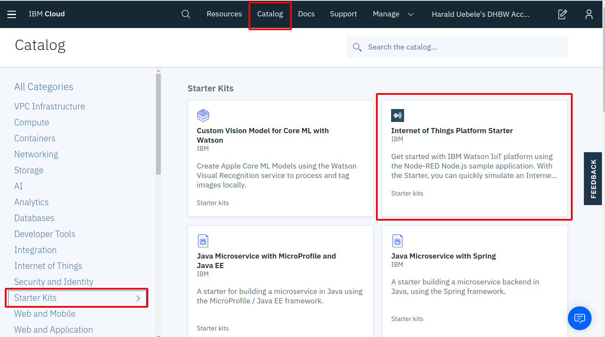

# IBM Cloud IoT Platform Service

The  IBM Cloud IoT Platform Service is a MQTT Broker "as a Service" on the IBM Cloud. 

## Create the IoT Platform Service

1. Logon to the [IBM Cloud](https://cloud.ibm.com)

2. Click the blue "Create Resource" button

3. On the left side, select 'Internet of Things', then click on the 'Internet of Things Platform tile'

4. Give the service a name, I use my intitals and '-iotp' so I know what it is:

Region / Organisation / Space should be filled in.
Click 'Create'.

5. The IBM Cloud Dashboard will switch to another view. Most likely it will offer switching of plans. Ignore this, we will use the 'Lite' (free) plan, it just takes a moment for the service to be created. After a minute or two refresh your browser and, if necessary, switch to the 'Manage' tab:

Click "Launch" to open the Dashboard of the IotP Service.

## Register an IoT Device

In the IoTP Dashboard complete the following steps to prepare  a scenario that uses a simulated thermostat to monitor temperature and humidity of a room.

1. IoT Platform Dashboard should be open from the last task.

2. Make TLS optional
      
    TLS is enforced for connection security by default (good thing for a production environment) but for the sake of simplicity we are going to make TLS optional for this workshop.

    a. In the menu on the left side click Security, then on the Edit icon for Connection Security.

    b. For scope Default, select Security Level 'TLS Optional'. Click OK on the Warning pop-up. Then click Save in the upper right corner.

    

3.   Create a device type.

        a. From the main menu, select Devices.

        b. Open the Device Types tab (from: Browse | Action | Device Types | Interfaces)

        c. Click  Add Device Type, 
        Enter a unique name (e.g. "simulator") and description for your device type, and click Next.

        

        (optional) Defining a Template and Metadata on the next two pages is optional and can be safely skipped by clicking Next on each page.

        d.  Click Finish to add the device type.

4.   Add a device that uses the newly created device type

       a. Click Register Devices. The device type that you just created is displayed in the list of device types.

       b. Enter a unique Device ID (e.g. "sim-1"). Click Next.

        (optional) Providing descriptive data on the Add Device page or entering device metadata on the next page is optional, and you can safely skip those pages by clicking Next on each page.

        c.  On the Security page, enter an Authentication Token = password for your new device, then click Next.

        d. On the Summary page, verify that the information is correct and click Finish to add the device. 
         
Copy or write down the information that is displayed in the Your Device Credentials page. 
You will need the following information to configure the simulator in the next step:

        * Organization ID
        * Device Type
        * Device ID
        * Authentication Token (= Password)

You can find the Organization ID in the upper right corner of the IoTP Dashboard, under your User ID, it is the six characters after ID. They are also the first characters of the IoTP Dashboard URL (e.g. "https://abcdef.internetofthings.ibmcloud.com/dashboard/...").

Keep this page open in your browser, but go to Recent Events or State. They will be empty for now.

__Continue with [IoT Simulator ](APP.md)__   
