### IBM Cloud IoT Platform Starter

In the IBM Cloud Dashboard create an instance of the [Node-RED Starter](https://cloud.ibm.com/docs/starters/Node-RED?topic=starters-gettingstarted#nodered).

Perform the following steps:

1.   Create an instance of the Starter Kit:

        a. Log in to or register for IBM Cloud at https://cloud.ibm.com.

        b. Open the catalog by selecting the catalog tab.

        c. Select the Starter Kits category and there select the Node-RED Starter.

        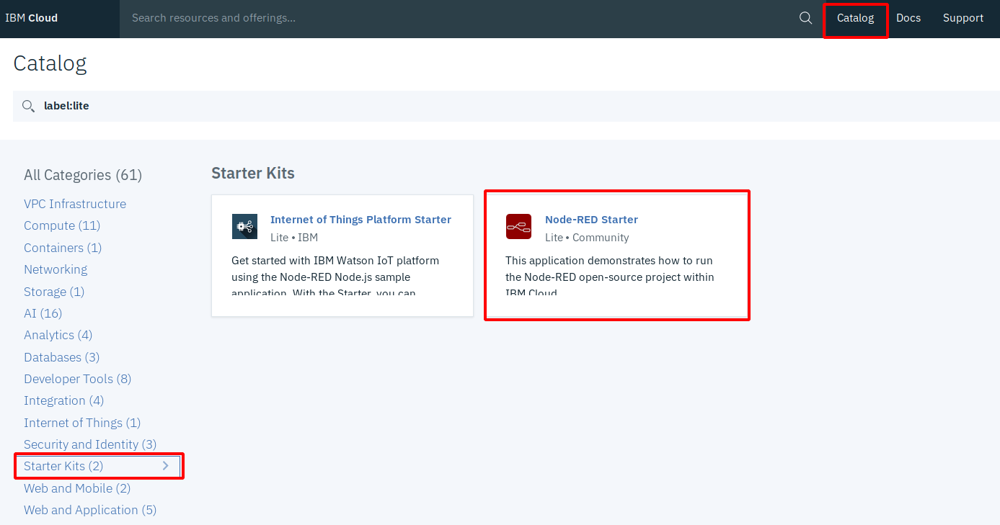

        d. On the Create a Cloud Foundry App page, enter a unique

            App Name
            Host Name

        and verify the selections  for:   

            Region/Location
            Organization
            Space

        Leave the defaults for the rest.    
       
       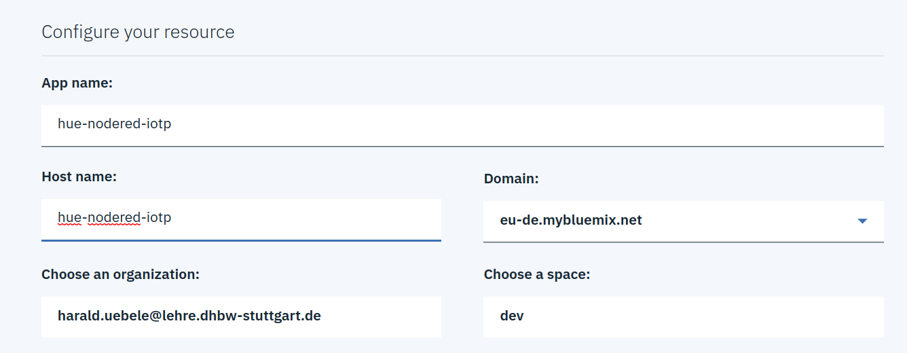

2. Click Create to add Node-RED to your IBM Cloud organization.   

After the application is deployed, the Getting Started page of your new app is displayed. The status will be "starting" for a while, this will switch to "ready" or "This app is awake" once it is started.
        
Note: The staging process might take a few minutes.

## Node-RED

You just created a Cloud Foundry app that runs Node-RED on Node.js. 

[Node-RED](https://nodered.org/) is "_a programming tool for wiring together hardware devices, APIs and online services in new and interesting ways._" It is a browser-based programming tool where you wire "nodes" together to form a flow and Node-RED creates node.js code from it and executes it. It has started as a simple graphical programming tool for the Internet of Things by IBMers Nick O'Leary and Dave Conway-Johnes and is now an open source project at the JS Foundation.

Open the Overview page of your app. Under Connections you can see one Service, a Cloudant Database, bound to the Cloud Foundry App. Cloudant is a NoSQL database and used to store the code, Cloud Foundry apps have no persistent file system.

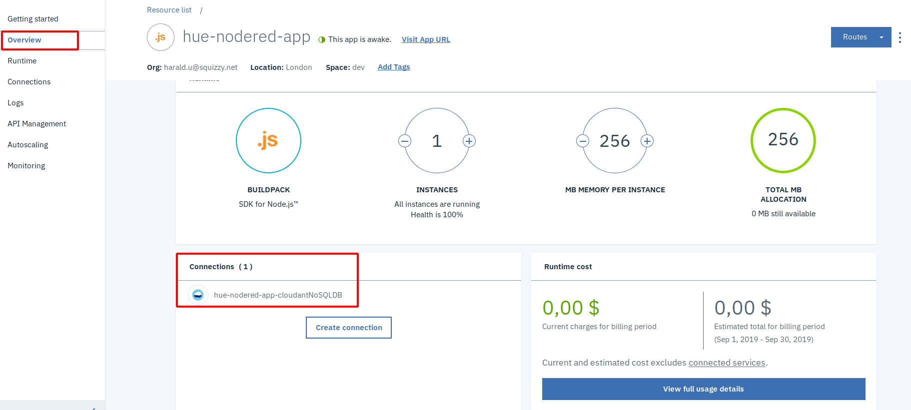

Click on Runtime and Environment Variables. Here you see something Cloud Foundry specific. Cloud Foundry uses an environment variable (VCAP_SERVICES) that is injected into the container that executes the application code. The application is able to read the environment variable which contains the credentials (all the information that an application needs to access a service like URL, user, password, and such) of all bound services. If you scroll through VCAP_SERVICES you can see a JSON object for "cloudantNoSQLDB" and it contains the access information for the Cloudant database. 

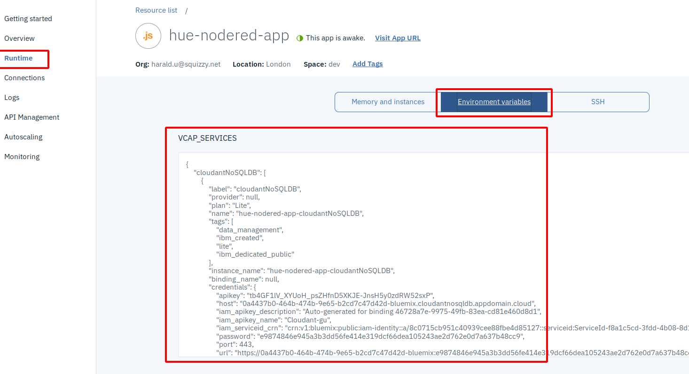

Now click on "Visit App URL" .

When you start Node-RED on the IBM Cloud for the first time you are asked to secure the editor. This is a good thing otherwise it would be accessible to everybody on the Internet. Secure it by entering a Username and Password (which you should be able to remember!) A certain level of password complexity is required otherwise you can't continue. Finish the setup and wait for a generic Node-RED page to appear. Click on "Go to your Node-RED flow editor". It will ask for your Username and Password. 

Node-RED will open with an empty "flow":

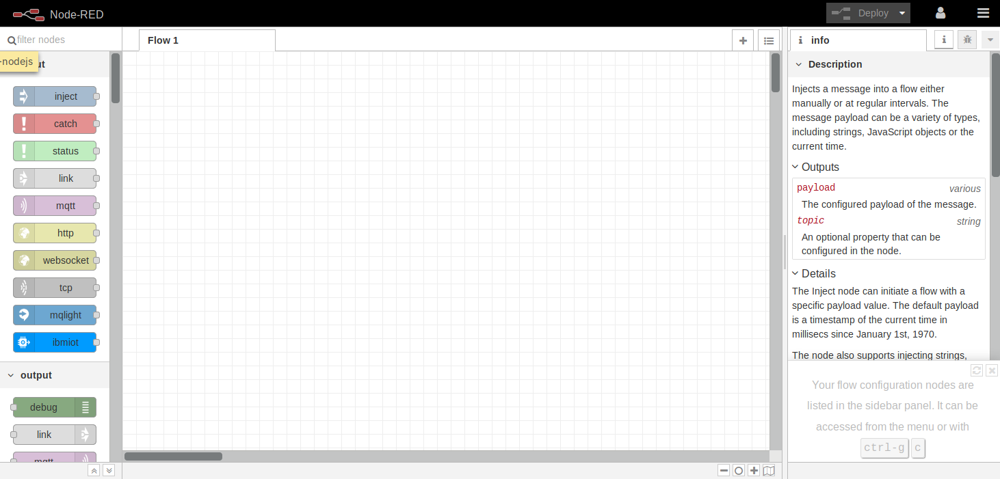

The left part is the "Palette", the middle section is the workspace, on the right you can see different types of information, default is to open up in the "Information" view.

## Create API Key for Node-RED

Node-RED needs to be able to access the IoT Platform service and in order to do that it requires an API Key.

1. Go back to the IBM Cloud Dashboard and in the burger menu select "Resource List".

2. Open the "Cloud Foundry Services" section and click on your IoT Platform service. Click on the name (which is a link)!

3. Click on "Launch" to open the IoT Platform dashboard.

4. Open the "Apps" section in the left menu, the click on "+ Generate API Key"
    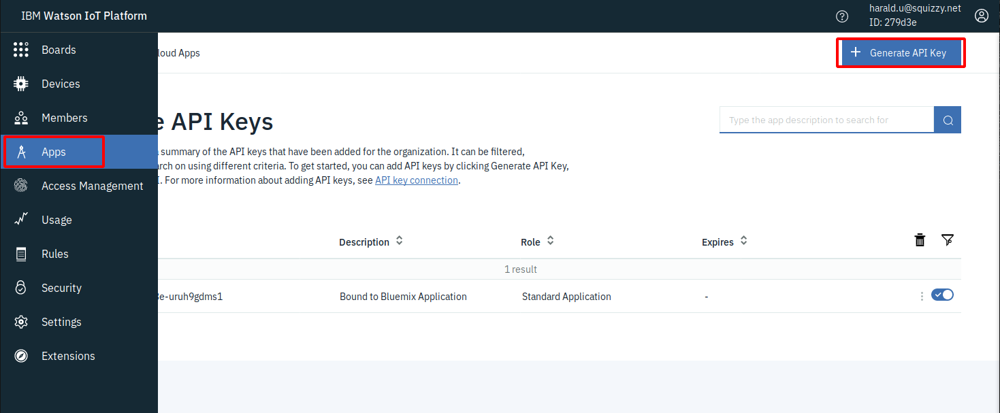

5. Enter a description (e.g. "Node-RED") and click "Next".

6. Leave the role "Visualisation Application", this gives access to live data.

7. Click "Generate Key" and make a copy of the API Key and especially the Authentication Token, this cannot be recovered later!
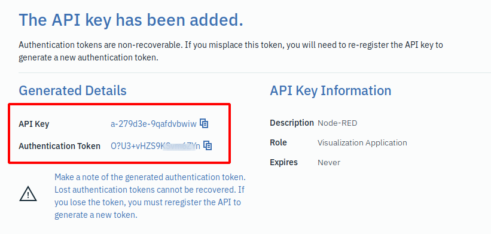

## Create a flow

You are now ready to create your first "flow".  

1. From the "input" section of the palette drag and drop a blue "ibmiot" node to the workspace.

2. From the "output" section of the palette drag and drop a green "debug" node to the workspace and place it to the right of the "ibmiot" node".

3. Both nodes have a grey I/O "port" (grey squares with rounded corners), the "ibmiot" node on the right side (this is an output), the "debug" node on the left side (this is an input). If you move the cross shaped cursor directly over an I/O port, its color changes to orange. At that moment you click the left mouse button, then you can draw a wire connection to another I/O port while holding the mouse botton. When you reach the other I/O port, release the mouse button. Using this method connect the "ibmiot" node with the "debug" node:
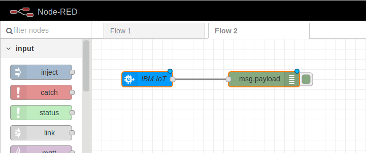

4. Double click the "ibmiot" node, this opens the Properties dialog. Authentication is "API Key". Click the "Edit" symbol to the right of "Add new ibmiot...".

5. The properties dialog of "Add new ibmiot config node" opens. Enter a name, the API Key, and the Authentication Token. We have created a keythis in the section [Create API Key for Node-RED](#Create-API-Key-for-Node-RED). Server name is your IoTP Org ID (see config.json in the iot-app directory) followed by ".messaging.internetofthings.ibmcloud.com". "Add" the config node.
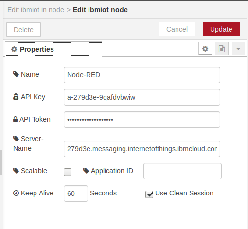

6. Back in the "Edit ibmiot node" dialog:
Input type should remain "Device Event", we use an event topic in the simulator code.
Enter the name of your "Device Type", select "All" for ID, enter the Event, "json" for Format (again, this can be found in the config.json file in iot-app). Click "Done" then "Deploy". 
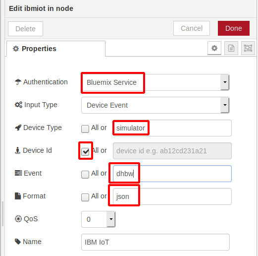

7. If your node.js simulator is stopped, start it again (npm start).

8. In the right window section, open the Debug view ("bug" icon). You should see the MQTT messages coming in:
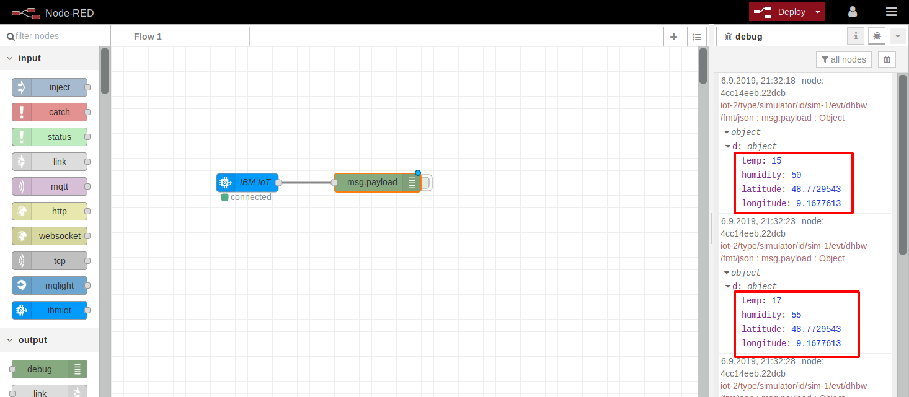

 We now have a full MQTT chain: a (simulated)  device is sending sensor data (temperature and humidity) via MQTT to an MQTT Broker (IoT Platform), and an application is subscribing to this data and displaying it. 

 In the next section we will learn how to save the data into the Cloudant database and then how to display data a little nicer by extending Node-RED.

### Store IoT data in Cloudant database

Cloudant is a NoSQL database. It is a commercial database service offering in the IBM Cloud and it is based on Apache CouchDB. Unlike Relational or SQL databases, NoSQL databases do not have a fixed structure of their records. Instead, they can store data in variable JSON format. Remember, our IoT data are in JSON format, too.

Have a look at the Cloudant dashboard:

1. In the Resource List, open the Cloud Foundry Services and the Services section. You will see a Cloudant service in each of them, but the service in the Cloud Foundry Service section has a link symbol. When you hover your mouse pointer over the link symbol you'll see that it is an alias. IBM Cloud needs the alias to bind it to the Cloud Foundry app.
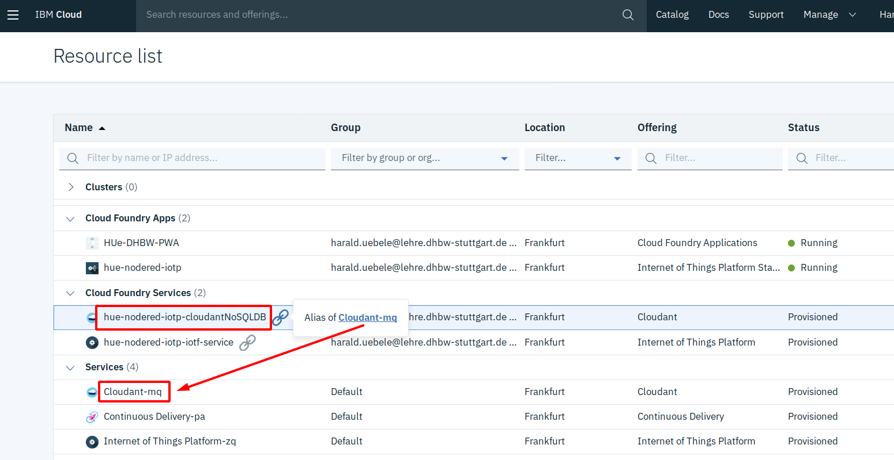

2. Click on the name of the Cloudant service in the Services section (non alias). This opens the Manage Cloudant view with additional details. In here click on "Launch Cloudant Dashboard".

3. The Databases view of the Cloudant dashboard opens and you should see a database "nodered". This database holds Node-RED information. Have a look at it but do not change anything, it would most likely destroy your Node-RED instance.

4. Go back to the Node-RED editor in your browser.

5. In the palette, scroll down to the "storage" section.

6. There are 2 Cloudant nodes. One is a node for searching documents (input and output port), the other is a simple Cloudant output node (which only has an input). Drag this out node to your workspace somewhere under the debug node, connect it with the ibmiot node, and double click it to open the Properties dialog.
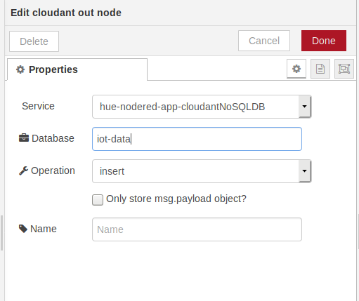

7. The Service field already shows the name of the Cloudant alias.
Enter a name for the database, e.g. "iot-data". Click Done, then Deploy.
Make sure your simulator is still running!

8. Go back to the database view of the Cloudant dasboard. You will see a database "iot-data" that hasn't been there before. It should indicate that it already contains some records. Open it.
It looks kind of cryptic, Cloudant is automatically creating Id's for us. If you open one of the records, the data should look familiar, though. Every bit of information the IoT Platform, the MQTT Broker, provides is there. The "_id" and "_rev" fields are Cloudant internal.
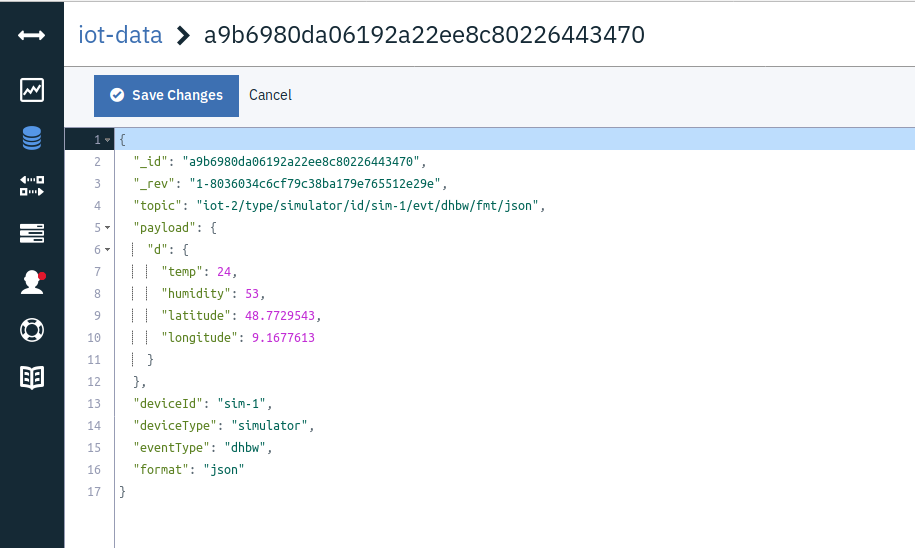

This was a very simple way to store IoT data. You would use this if you need to archive historical data or use an anlytics or machine learning tool to further analyse the data.

__Continue with [Dashboard ](DASHBOARD.md)__   